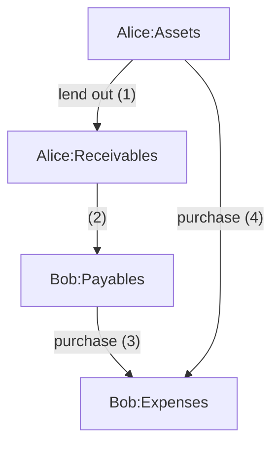

# `autobean.share`: Rationale

## Scenario

Consider a simple case: Alice bought a $20 cinema ticket for Bob, who promised to repay. What happened to them financially?

* Alice paid $20 (Alice Assets -$20).
* In return, Alice got Bob's committment to repay, which is worth $20 (Alice Receivable +$20).
* That committment also marks Bob's liability to repay (Bob Payable +$20).
* In exchange for that liability, Bob got the cinema ticket, which is worth $20 (Bob Expenses +$20).



## First attempt

As we can see, there are four changes and they are interrelated. How we book this? A natural solution is:

```beancount
; alice.bean

2000-01-01 *
    Assets:Bank                  -20.00 USD
    Assets:Receivable:Bob         20.00 USD

; bob.bean

2000-01-01 *
    Liabilities:Payable:Alice    -20.00 USD
    Expenses:Movie                20.00 USD
```

Sadly, this only reflects relationship 1 and 3, while 2 and 4 are lost. Our interrelated events are now just some fragmented pieces. What a pity!

People might argue 2 and 4 are insignificant. Sometimes they do, but it's always good to keep track of the full context if possible, and in particular:

* This information is hard to recover from / cross check against supporting materials.
    * Likely there isn't a written loan agreement between Alice and Bob.
    * The bank statements of Alice will show a card payment at XXX cinema instead of a bank transfer to Bob, which isn't apparent to be a loan.
* Alice might want to use this information later.
    * If Bob forgets about this loan, Alice will be able to remind him with some context.
    * If Alice and Bob are to review their books together, it's good if these two transactions can be linked together.
    * If Alice later decides to waive all Bob's debt on movie, she'll need some information to find them out.
    * If Alice later finds out it was a booking mistake and that ticket was bought for Charlie, she'll need some information to find this transaction out of possibly many other debt with Bob.

## Try again

Then, how can we note down relationship 2 and 4? One might come up with something like this:

```beancount
; overall.bean

2000-01-01 *
    ; relationship 4
    Assets:Bank                  -20.00 USD
    Expenses:Movie                20.00 USD
    ; relationship 2
    Liabilities:Payable:Alice    -20.00 USD
    Assets:Receivable:Bob         20.00 USD
```

While this may initially feel weird, it is indeed valid and with a sound semantics: the observation from the overall **viewpoint**, or, if you like to call it this way, Alice's and Bob's transactions added together.

If they are the same family, this might be good to allow them collectively review the overall family expenditure.

Ok, so is this our solution? Probably not good enough yet:

* While this does sort of imply all four relationships, it is in a fairly weak way. Everything is just brutally combined together while how things are internally related is not obvious.
* Where should this transaction go? It is observed from neither Alice or Bob's viewpoint but the combination, which means it doesn't belong to either's ledger.
    * Does this mean there must be a shared ledger and people can no longer keep track of everything at a single place?
* This is fairly redundant: we know the ticket is $20 so all four postings must all be ±$20. Then why do we have to repeat the same thing four times instead of just once?

## Almost good

Either way doesn't seem ideal. Now let's recap, what do we want?

* Truthful: it should be faithfully reflect the fact
* Pragmatic: it should allow Alice and Bob to reference easily
* Comprehensive: it should contain all the relationship
* Concise: it should minimize redundancies

And how do we do that in natural language? Probably, "Bob bought a cinema ticket with Alice's card". It's just that simple. Can we encode that in beancount? Sure.

```beancount
; concise.bean

; Below uses a fictional syntax for illustration. See README.md for the real syntax.

2000-01-01 *
    Assets:Bank                  -20.00 USD
        owner: Alice
    Expenses:Movie                20.00 USD
        owner: Bob
```

Now let's tick the boxes:

* Is it truthful? Yes, it does reflect the facts.
* Is it concise? Yes, it has only two postings and you can even omit one of the amount.
* Is it comprehensive? Implicitly yes. It's probably not apparent, but we didn't lose any information from that natural language description. So if people can read the debt from that sentence, in theory they can also get it from the snippet.
* Is it pragmatic? Only partially. It is useful to look at as a whole but it can't be integrated to either's ledger.

## The final piece

Now we just need to fix the pragmatic pillar.

The comprehensiveness box has been ticked so we have all the information noted down, which means the remaining work is just some sort of inferrence and conversion, which computer is good at!

What about letting the human write `concise.bean` and computer generate `alice.bean`, `bob.bean`, and `overall.bean`? Both of them can integrate it into their own ledger, while being able to review the whole thing collectively if needed.

Sounds great. Let's do that.

## Implementation

How do we do that? The principle here is actually quite simple:

* Every posting must have a owner
* Postings in each transaction must balance.
    * If they don't, it's a booking error.
* Postings for each owner in each transactions must balance.
    * If they don't, we generate some Receivables / Payables to offset the difference.

To put it in our example:

* Alice owns the Assets posting because it's her bank account.
* Bob owns the Expenses posting because it's his expenditure.
* The whole transaction balances.
* Alice only has one posting, which doesn't balance, so she gets a $20 receivable to offset that.
* Bob only has one posting, which doesn't balance, so he gets a -$20 payable to offset that.

This gives us:

```beancount
2000-01-01 *
    ; Alice
    Assets:Bank                  -20.00 USD
    Assets:Receivable:Bob         20.00 USD ; auto-generated
    ; Bob
    Expenses:Movie                20.00 USD
    Liabilities:Payable:Alice    -20.00 USD ; auto-generated
```

Then it's merely a matter of what we are interested in. If we keep everything, it's `overall.bean`. If we only keep Alice's postings and the generated receivable, it's `alice.bean`, and same for Bob.
